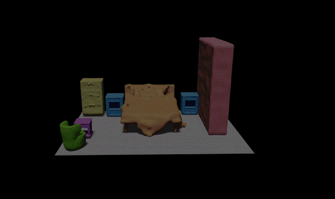

<div align="center">
<h1> EchoScene: Indoor Scene Generation via Information Echo over Scene Graph Diffusion</h1>
</div>
<br>
<div align="center">
  <a href="https://ymxlzgy.com/">Guangyao Zhai</a>, <a href="https://evinpinar.github.io/">Evin Pınar Örnek</a>, <a href="https://daveredrum.github.io/">Dave Zhenyu Chen</a>, <a href="https://scholar.google.com/citations?user=XFQv_oYAAAAJ&hl=en">Ruotong Liao</a>, <a href="https://shangbuhuan13.github.io/">Yan Di</a>, <br> <a href="https://federicotombari.github.io/">Federico Tombari</a>, <a href="https://www.cs.cit.tum.de/camp/members/cv-nassir-navab/nassir-navab/">Nassir Navab</a>, and <a href="https://www.cs.cit.tum.de/camp/members/benjamin-busam/">Benjamin Busam</a>
</div>
<br>
<div align="center">
  Technical University of Munich <span style="margin: 0 10px;">•</span> Ludwig Maximilian University of Munich <span style="margin: 0 10px;">•</span> Google
</div>

<br>
<div align="center">
<h3>
  <a href="https://arxiv.org/abs/2405.00915">Arxiv</a> | <a href="https://sites.google.com/view/echoscene">Website</a>
</h3>
</div>
<br>
<div align="center">
  
</div>


## Setup
### Environment

```javascript
conda create -n echoscene python=3.8
conda activate echoscene
```
We have tested it on Ubuntu 20.04 with PyTorch 1.11.0, CUDA 11.3 and Pytorch3D.

```javascript
pip install -r requirements.txt 
pip install einops omegaconf tensorboardx open3d
```
(Note: if one encounters a problem with PyYAML, please refer to [this link](https://stackoverflow.com/questions/49911550/how-to-upgrade-disutils-package-pyyaml).)

Install mmcv-det3d (optional):

```javascript
mim install mmengine
mim install mmcv
mim install mmdet
mim install mmdet3d
```

Install CLIP:

```javascript
pip install ftfy regex tqdm
pip install git+https://github.com/openai/CLIP.git
```
### Dataset

I. Download [3D-FUTURE-SDF](https://www.campar.in.tum.de/public_datasets/2023_commonscenes_zhai/3D-FUTURE-SDF.zip). This is processed by ourselves on the 3D-FUTURE meshes using tools in [SDFusion](https://github.com/yccyenchicheng/SDFusion).

II. Follow [this page](https://sites.google.com/view/commonscenes/dataset) for downloading SG-FRONT dataset and accessing more information.

III. Optional
1. Download the <a href="https://tianchi.aliyun.com/specials/promotion/alibaba-3d-scene-dataset">3D-FRONT dataset</a> from their official site.

2. Preprocess the dataset following  <a href="https://github.com/nv-tlabs/ATISS#data-preprocessing">ATISS</a>.

IV. Create a folder named `FRONT`, and copy all files to it.

The structure should be similar like this:
```
FRONT
|--3D-FUTURE-SDF
|--All SG-FRONT files (.json and .txt)
|--3D-FRONT (optional)
|--3D-FRONT-texture (optional)
|--3D-FUTURE-model (optional)
|--3D-FUTURE-scene (optional)
|--3D-FRONT_preprocessed (optional, by ATISS)
|--threed_front.pkl (optional, by ATISS)
```
### Models
**Essential:** Download pretrained VQ-VAE model from [here](https://www.campar.in.tum.de/public_datasets/2023_commonscenes_zhai/vqvae_threedfront_best.pth) to the folder `scripts/checkpoint`.

**Optional:** We provide two trained models: `EchoLayout` available [here](https://www.campar.in.tum.de/public_datasets/2024_echoscene/released_layout_model.zip) and `EchoScene` available [here](https://www.campar.in.tum.de/public_datasets/2024_echoscene/released_full_model.zip).

## Training

To train the models, run:

```
cd scripts
python train_3dfront.py --exp /path/to/exp_folder --room_type all --dataset /path/to/dataset --residual True --network_type echoscene --with_SDF True --with_CLIP True --batchSize 64 --workers 8 --loadmodel False --nepoch 10000 --large False --use_scene_rels True
```
`--exp`: the path where trained models and logs would like to be stored.

`--room_type`: rooms to train, e.g., 'livingroom', 'diningroom', 'bedroom', and 'all'. We train all rooms together in the implementation.

`--network_type`: the network to be trained. `echoscene` is EchoScene, `echolayout` is EchoLayout (retrieval method, single layout generation branch).

`--with_SDF`: set to `True` if train EchoScene.

`--batch_size`: the batch size for the layout branch training.

`--large` : default is `False`, `True` means more concrete categories.

## Evaluation

To evaluate the models run:
```
cd scripts
python eval_3dfront.py --exp /path/to/trained_model --dataset /path/to/dataset --epoch 2050 --visualize True --room_type all --render_type echoscene --gen_shape True
```
`--exp`: where the models are stored. If one wants to load our provided models, the path should be aligned with 

`--gen_shape`: set `True` if one wants to make shape branch work.

### FID/KID
This metric aims to evaluate scene-level fidelity. To evaluate FID/KID, you need to collect ground truth top-down renderings by modifying and running `collect_gt_sdf_images.py`.

Make sure you download all the files and preprocess the 3D-FRONT. The renderings of generated scenes can be obtained inside `eval_3dfront.py`.

After obtaining both ground truth images and generated scenes renderings, run `compute_fid_scores_3dfront.py`.
### MMD/COV/1-NN
This metric aims to evaluate object-level fidelity. To evaluate this, you need to first obtain ground truth object meshes from [here](https://www.campar.in.tum.de/public_datasets/2023_commonscenes_zhai/gt_fov90_h8_obj_meshes.zip) (~5G). 

Secondly, store per generated object in the generated scenes, which can be done in `eval_3dfront.py`.
After obtaining object meshes, modify the path in `compute_mmd_cov_1nn.py` and run it to have the results.
## Acknowledgements 
**Relevant work:** [Graph-to-3D](https://github.com/he-dhamo/graphto3d), [CommonScenes](https://github.com/ymxlzgy/commonscenes), [DiffuScene](https://github.com/tangjiapeng/DiffuScene), [InstructScene](https://github.com/chenguolin/InstructScene), [SceneTex](https://github.com/daveredrum/SceneTex).

**Disclaimer:** This is a code repository for reference only; in case of any discrepancies, the paper shall prevail. 

We thank DiffuScene's author [Jiapeng Tang](https://tangjiapeng.github.io/) and InstructScene's author [Chenguo Lin](https://chenguolin.github.io/) for providing the code and helpful discussions, and additionally thank [Mahdi Saleh](https://mahdi-slh.github.io/) for titling the paper as `EchoScene`, which is vivid and catchy :)
